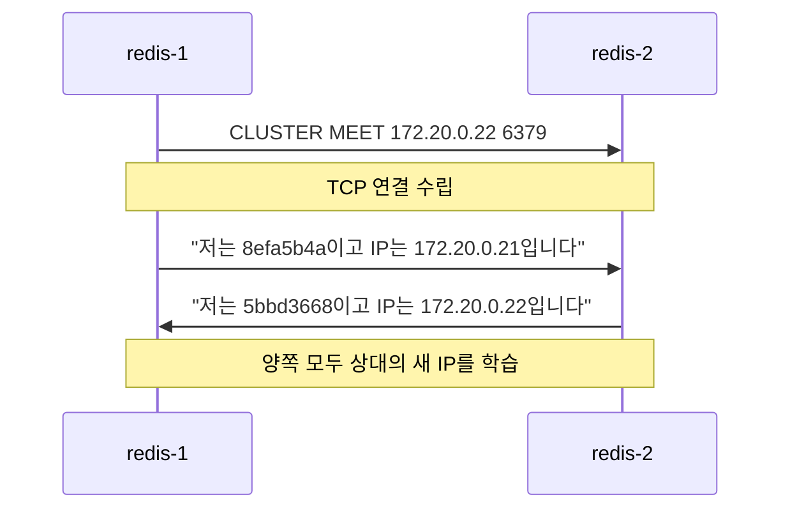
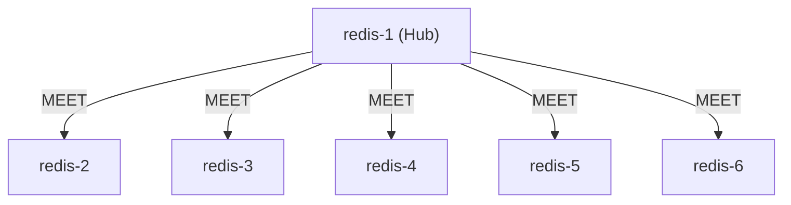
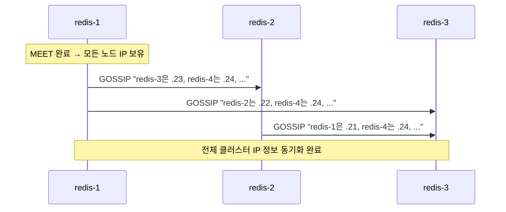

# Redis Cluster의 IP 변경과 복구 메커니즘 — GOSSIP, CLUSTER MEET 동작 원리

> Kubernetes 환경에서 Redis Cluster를 운영하다 보면 Pod 재시작으로 인한 IP 변경이 빈번하게 발생합니다.
> 이 글에서는 Redis Cluster가 IP 변경을 어떻게 인식하고, 클러스터를 어떻게 복구하는지
> Docker Compose 실험을 통해 확인한 내용을 정리합니다.

---

## 목차

1. [배경: redis.conf vs nodes.conf](#1-배경-redisconf-vs-nodesconf)
2. [GOSSIP 프로토콜과 합의](#2-gossip-프로토콜과-합의)
3. [실험: Docker Compose로 전체 IP 변경 시뮬레이션](#3-실험-docker-compose로-전체-ip-변경-시뮬레이션)
4. [복구: CLUSTER MEET](#4-복구-cluster-meet)
5. [GOSSIP 충돌 해결: 타임스탬프 기반](#5-gossip-충돌-해결-타임스탬프-기반)
6. [정리](#6-정리)

---

## 1. 배경: redis.conf vs nodes.conf

Redis Cluster를 구성하면 두 가지 설정 파일이 핵심적인 역할을 합니다.

| 파일 | 성격 | 내용 | 수정 주체 |
|---|---|---|---|
| `redis.conf` | **정적** 설정 | `cluster-announce-ip`, `cluster-enabled` 등 | 관리자 (또는 Init Container) |
| `nodes.conf` | **동적** 클러스터 상태 | 노드 목록, IP, 슬롯 배치, 타임스탬프 등 | Redis 프로세스가 자동 관리 |

Redis가 시작될 때 두 파일에 담긴 IP 정보가 충돌하면 다음 규칙이 적용됩니다.

- **자기 자신의 IP** → `redis.conf`의 `cluster-announce-ip`가 우선합니다.
- **다른 노드의 IP** → `nodes.conf`에 기록된 값을 그대로 사용합니다.

즉, 노드가 재시작되면 자신의 새로운 IP는 정확히 알지만 다른 노드의 IP는 이전 값 그대로 남게 됩니다. 이것이 문제의 출발점입니다.

---

## 2. GOSSIP 프로토콜과 합의

Redis Cluster의 모든 노드는 주기적으로 **GOSSIP 메시지**를 교환하며 클러스터 상태를 동기화합니다.
그런데 모든 변경에 "합의"가 필요한 것은 아닙니다. 동작의 종류에 따라 합의 여부가 달라집니다.

| 동작 | 투표(합의) 필요 여부 | 이유 |
|---|---|---|
| IP 변경 (GOSSIP) | **불필요** | 단순 정보 업데이트이므로 위험하지 않음 |
| Master failover | **필요** (과반수) | Slave → Master 승격은 데이터 일관성에 영향 |
| Node fail 판정 | **필요** (과반수) | 잘못된 판정 시 불필요한 failover가 발생 |

비유하자면:

- **IP 변경**은 **"이사 알림"** 입니다. "저 이사했어요"라고 알려주면 주소록을 고치면 그만입니다.
- **Failover**는 **"왕위 계승"** 입니다. 왕이 사라졌을 때 새 왕을 세우려면 신하들의 과반수 동의가 필요합니다.

IP 변경 시 GOSSIP을 통한 업데이트 흐름은 다음과 같습니다.

```
redis-6 → GOSSIP → redis-1:
  "저는 39d4c6ca이고, IP가 172.20.0.16입니다."
redis-1:
  nodes.conf 업데이트 → 완료
```

별도의 투표 절차 없이, 받은 즉시 반영됩니다.

---

## 3. 실험: Docker Compose로 전체 IP 변경 시뮬레이션

### 3.1 실험 환경

Docker Compose로 6노드 Redis Cluster(Master 3 + Slave 3)를 구성하고,
**모든 노드의 IP를 동시에 변경**하는 상황을 재현했습니다.

### 3.2 시나리오

각 노드의 실제 Docker IP와 `redis.conf`의 `cluster-announce-ip`를 새로운 대역(2x)으로 변경하되,
**`nodes.conf`는 이전 IP(1x)를 그대로 유지**합니다.

| 노드 | 실제 IP (Docker) | redis.conf announce-ip | nodes.conf (이전 IP) |
|---|---|---|---|
| redis-1 | 172.20.0.**21** | 172.20.0.**21** | 172.20.0.**11** |
| redis-2 | 172.20.0.**22** | 172.20.0.**22** | 172.20.0.**12** |
| redis-3 | 172.20.0.**23** | 172.20.0.**23** | 172.20.0.**13** |
| redis-4 | 172.20.0.**24** | 172.20.0.**24** | 172.20.0.**14** |
| redis-5 | 172.20.0.**25** | 172.20.0.**25** | 172.20.0.**15** |
| redis-6 | 172.20.0.**26** | 172.20.0.**26** | 172.20.0.**16** |

이 상태는 Kubernetes에서 StatefulSet의 모든 Pod가 한 번에 재시작된 상황과 동일합니다.

### 3.3 결과

```bash
$ docker exec -it redis-1 redis-cli cluster nodes
```

```
redis-1 (myself): 172.20.0.21  ← redis.conf의 announce-ip가 적용됨 (정확)
redis-2:          172.20.0.12  ← nodes.conf의 이전 IP 그대로 → fail?
redis-3:          172.20.0.13  ← 이전 IP → fail?
redis-4:          172.20.0.14  ← 이전 IP → fail?
redis-5:          172.20.0.15  ← 이전 IP → fail?
redis-6:          172.20.0.16  ← 이전 IP → fail?
```

**자기 자신의 IP만 `redis.conf`를 통해 올바르게 업데이트되고, 다른 노드의 IP는 `nodes.conf`의 이전 값이 그대로 남았습니다.**

여기서 `fail?`은 `pfail`(Possible Fail) 상태를 의미합니다.
"연결이 안 되는데 혹시 죽었나?" 하고 의심하는 단계이며, 시간이 지나면 `fail`로 확정됩니다.
172.20.0.1x 대역에는 아무 노드도 없으므로, 영원히 연결되지 않습니다.

> **이것이 바로 Kubernetes에서 모든 Pod가 재시작될 때 발생하는 상황입니다.**
> 모든 노드가 서로의 새 IP를 모르기 때문에 클러스터가 완전히 붕괴됩니다.

---

## 4. 복구: CLUSTER MEET

### 4.1 CLUSTER MEET가 필요한 상황

```
모든 노드의 IP가 변경되어 서로를 찾을 수 없는 상태
  → 노드 간 GOSSIP 교환 자체가 불가능
  → 외부에서 CLUSTER MEET 명령으로 새 IP를 알려주어야 합니다
```

Kubernetes Operator에서는 `RepairDisconnectedNodes` 함수가 이 역할을 수행합니다.

### 4.2 CLUSTER MEET의 동작: 양방향 핸드셰이크

`CLUSTER MEET`는 일방적인 알림이 아니라 **양방향 핸드셰이크**입니다.



한 번의 MEET으로 **양쪽 노드 모두** 상대의 새 IP를 알게 됩니다.

### 4.3 Hub 방식: N-1번이면 충분합니다

6개 노드의 IP가 모두 변경되었을 때, 모든 쌍에 대해 MEET를 수행하면 15번(6×5÷2)이 필요할 것 같지만,
실제로는 **한 노드를 허브로 삼아 5번이면 충분**합니다.



```bash
# redis-1을 허브로 사용하여 5번만 실행
docker exec -it redis-1 redis-cli CLUSTER MEET 172.20.0.22 6379
docker exec -it redis-1 redis-cli CLUSTER MEET 172.20.0.23 6379
docker exec -it redis-1 redis-cli CLUSTER MEET 172.20.0.24 6379
docker exec -it redis-1 redis-cli CLUSTER MEET 172.20.0.25 6379
docker exec -it redis-1 redis-cli CLUSTER MEET 172.20.0.26 6379
```

이 시점에서 redis-1은 모든 노드의 새 IP를 알게 됩니다.
이후 **GOSSIP이 나머지를 자동으로 전파**합니다.



| 방식 | MEET 횟수 (N=6) | 설명 |
|---|---|---|
| 모든 쌍에 대해 MEET | 15번 (N×(N-1)÷2) | 불필요하게 많음 |
| **허브 방식** | **5번 (N-1)** | GOSSIP이 나머지를 전파 |

Kubernetes Operator의 `RepairDisconnectedNodes`도 이와 동일한 방식으로 동작합니다.
leader-0 Pod에서 모든 노드에 대해 `CLUSTER MEET`를 한 번씩만 실행합니다.

---

## 5. GOSSIP 충돌 해결: 타임스탬프 기반

### 5.1 문제: 노드마다 다른 IP 정보를 가지고 있다면?

MEET 직후에는 redis-1만 모든 노드의 최신 IP를 알고 있고,
나머지 노드들은 여전히 이전 IP를 가지고 있을 수 있습니다.
GOSSIP 교환 시 서로 다른 정보가 충돌하면 **어떤 것이 맞는지 어떻게 판단할까요?**

### 5.2 답: pong_received 타임스탬프

GOSSIP 메시지에는 **"이 노드를 마지막으로 직접 확인한 시간(`pong_received`)"** 이 포함되어 있습니다.
노드는 항상 **더 최근 타임스탬프를 가진 정보를 채택**합니다.

```
[redis-1이 MEET로 redis-3을 직접 만남]
redis-1 → redis-3 (172.20.0.23에 연결)
redis-3 → redis-1: PONG "저는 172.20.0.23입니다"
redis-1 기록: "redis-3 = .23, 마지막 확인: 14:05:30" ← 최신

[redis-2는 아직 이전 정보 보유]
redis-2 기록: "redis-3 = .13, 마지막 확인: 13:50:00" ← 오래됨
```

이후 redis-1과 redis-2가 GOSSIP을 교환하면 다음과 같이 처리됩니다.

```
redis-1 → redis-2: "redis-3은 .23입니다 (14:05:30에 확인)"
redis-2 비교:
  내 정보: .13 (13:50:00)  ← 오래됨
  받은 정보: .23 (14:05:30) ← 더 최신
  → .23으로 업데이트!

redis-2 → redis-1: "redis-3은 .13입니다 (13:50:00에 확인)"
redis-1 비교:
  내 정보: .23 (14:05:30)  ← 더 최신
  받은 정보: .13 (13:50:00) ← 오래됨
  → 무시, .23 유지
```

**직접 연결(MEET)은 항상 최신 타임스탬프를 가지므로, 간접 전파(GOSSIP)보다 우선합니다.**

### 5.3 nodes.conf에서 타임스탬프 확인

실제 `nodes.conf` 파일에서 이 타임스탬프를 확인할 수 있습니다.

```
39d4c6ca... 172.20.0.26:6379 slave ... 1770610709914 ...
                                        ^^^^^^^^^^^^^^^
                                        pong_received (Unix 밀리초 타임스탬프)
```

---

## 6. 정리

### 핵심 요약

| 개념 | 설명 |
|---|---|
| `redis.conf` | 정적 설정. 시작 시 자기 자신의 IP(`cluster-announce-ip`)를 결정 |
| `nodes.conf` | 동적 클러스터 상태. 다른 노드의 IP 정보가 저장됨 |
| IP 변경 시 자기 IP | `redis.conf`의 `cluster-announce-ip`가 `nodes.conf`보다 우선 |
| IP 변경 시 타 노드 IP | `nodes.conf`에 기록된 이전 값을 그대로 사용 → 연결 실패 |
| GOSSIP | IP 변경은 투표 없이 즉시 반영 (failover와 다름) |
| CLUSTER MEET | 양방향 핸드셰이크. 양쪽 모두 상대의 새 IP를 학습 |
| 복구 전략 | 한 노드를 허브로 삼아 N-1번 MEET → GOSSIP이 나머지 전파 |
| 충돌 해결 | `pong_received` 타임스탬프 비교. 더 최신 정보가 채택됨 |

### 전체 복구 흐름


---

### 참고

- [Redis Cluster Specification - Failure detection](https://redis.io/docs/reference/cluster-spec/#failure-detection)
- [Redis Cluster Specification - Configuration handling, propagation, and failovers](https://redis.io/docs/reference/cluster-spec/)
- [CLUSTER MEET command](https://redis.io/commands/cluster-meet/)
